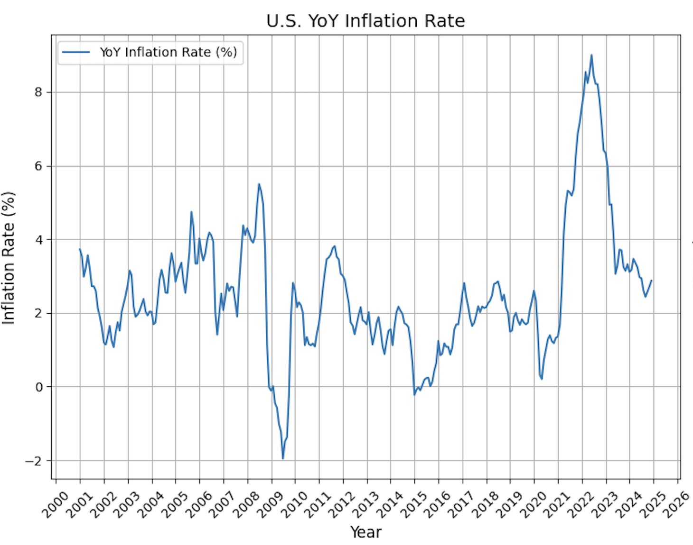
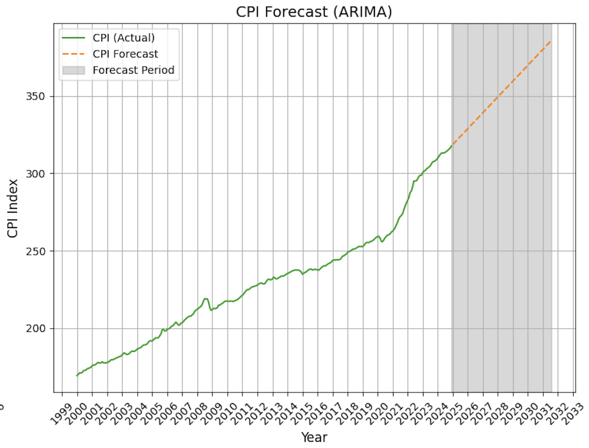

# 📈 Forecasting US CPI Inflation with ARIMA Model

## 🧾 Overview

This project is a Python-based system for forecasting the U.S. Consumer Price Index (CPI) and analyzing inflation. It utilizes an ARIMA time series model to generate forecasts, allowing users to specify a date range for analysis and a future period for prediction.

---

## ⚙️ Features

- **Data Acquisition:** Downloads CPI data directly from the Federal Reserve Economic Data (FRED) using `pandas_datareader`.
- **Data Preprocessing:**
  - Converts the data index to datetime for time series analysis.
  - Calculates Year-over-Year (YoY) inflation rate from CPI.
- **Time Series Analysis:** Fits an ARIMA model using `pmdarima` with automated parameter selection.
- **Forecasting:** Generates CPI forecasts for a user-specified number of months.
- **Visualization:**
  - Line plot of YoY inflation over the selected range.
  - Line plot of historical and forecasted CPI with a shaded forecast area.

---

## 🛠️ Technologies Used

- Python
- pandas  
- pandas_datareader  
- matplotlib  
- pmdarima  
- os  
- sys  

---

## 📦 Installation

### ✅ Prerequisites

- Python 3.6+
- pip (Python package installer)

### 💻 Clone the Repository

```bash
git clone https://github.com/Yassin-Ali-Youssry/Forecasting-US-CPI-Inflation-ARIMA-Model.git
cd Forecasting-US-CPI-Inflation-ARIMA-Model
```

### 📥 Install Requirements
```bash
pip install pandas pandas_datareader matplotlib pmdarima
```
---
## 🚀 Usage

### ▶️ Run the Script
```bash
python Forecasting\ US\ CPI.py
(Adjust the filename if yours differs.)
```
### ⌨️ Enter the Following When Prompted:
```bash
Start date (YYYY-MM-DD)
End date (YYYY-MM-DD)
Forecast period in months (integer)
```
### 🪄 Example Input
```bash
Enter start date (YYYY-MM-DD): 2000-01-01  
Enter end date (YYYY-MM-DD): 2024-12-30  
Enter forecast period in months: 80
```
## 📊 Sample Output

### U.S. YoY Inflation Rate
A line chart displaying inflation trends over the specified time window.


### CPI Forecast (ARIMA)
A visual of actual CPI data with future projections and uncertainty shaded.


---
## ⚠️ Important Considerations

Data Source: Requires internet access to fetch FRED data.
ARIMA Selection: Model parameters are selected automatically via auto_arima.
Forecast Accuracy: Results depend on historical patterns. Use caution and update periodically.
Error Handling: Basic validation exists, but production-level robustness can be improved.

---
## 🔮 Future Enhancements

Incorporate other economic indicators (e.g., interest rates, unemployment).
Add support for other models (SARIMA, Prophet, etc.).
Allow user-defined ARIMA parameters.
Export plots to file (PNG, PDF).
Develop an interactive dashboard (Dash or Streamlit).
Add model evaluation metrics (AIC, BIC, out-of-sample tests).
Include unit testing for reliability.
Implement stronger input validation.

---
## 🤝 Contributing

Contributions are welcome! Fork the repo, make your changes, and submit a pull request.

---
## 📄 License

This project is licensed under the MIT License.
