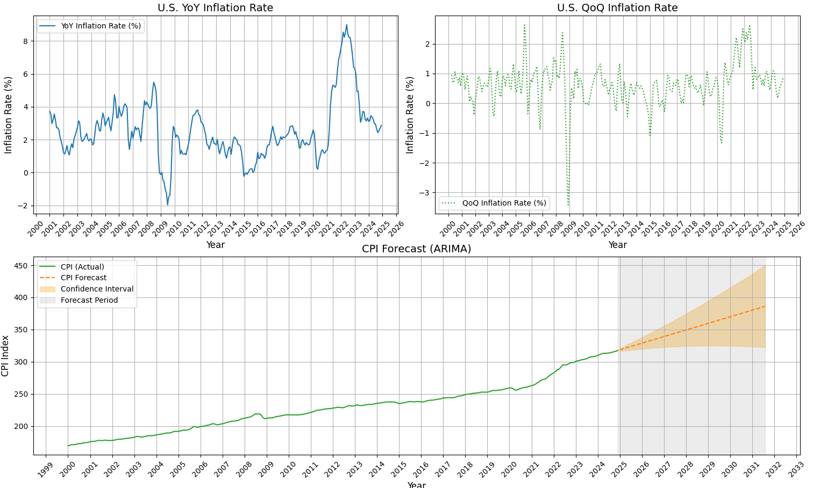

# 📈 Forecasting US CPI Inflation with ARIMA Model

## 🧾 Overview

This project is a Python-based application for forecasting the U.S. Consumer Price Index (CPI) and analyzing inflation metrics using ARIMA time series modeling. It allows users to input a custom date range and forecast horizon, then generates CPI projections with confidence intervals, along with visualizations for key inflation trends (YoY and QoQ).

---

## ⚙️ Features
### ✅ Data Collection & Preparation
 - Pulls CPI data directly from FRED using pandas_datareader.
 - Cleans and transforms time index to datetime format.
Computes:
- YoY Inflation: Year-over-year percentage change in CPI.
- QoQ Inflation: Quarterly (3-month) percentage change in CPI.
### 🧠 Forecasting Model
- Model Type: ARIMA (AutoRegressive Integrated Moving Average)
- Tool: pmdarima.auto_arima for automatic parameter tuning.
- Silent model fitting to reduce console clutter using redirected output and warning suppression.
### 📊 Visualization Suite
Combined dashboard includes:
- Top-left: Year-over-Year Inflation line chart.
- Top-right: Quarter-over-Quarter Inflation chart.
- Bottom (Full Width): Historical CPI + Forecast with shaded confidence intervals.
### 🔎 (Optional) Residual Diagnostics (currently commented)
- ARIMA residual analysis tools:
- Residual time series plot
- ACF & PACF charts
- Ljung-Box test for autocorrelation

---

## 🛠️ Technologies Used
- Python 3.6+
- pandas
- pandas_datareader
- matplotlib
- pmdarima
- statsmodels
- os, sys, warnings

---

## 📦 Installation

### ✅ Prerequisites

- Python 3.6+
- pip (Python package installer)

### 💻 Clone the Repository

```bash
git clone https://github.com/Yassin-Ali-Youssry/Forecasting-US-CPI-Inflation-ARIMA-Model.git
cd Forecasting-US-CPI-Inflation-ARIMA-Model
```

### 📥 Install Requirements
```bash
pip install pandas pandas_datareader matplotlib pmdarima statsmodels
```
---
## 🚀 Usage

### ▶️ Run the Script
```bash
python "Forecasting CPI Using ARIMA.py"
```
### ⌨️ Enter the Following When Prompted:
```bash
Start date (DD-MM-YYYY)
End date (DD-MM-YYYY)
Forecast period in months (integer)
```
### 🪄 Example Input
```bash
Enter start date (DD-MM-YYYY): 01-01-2000  
Enter end date (DD-MM-YYYY): 30-12-2024
Enter forecast period in months: 80
```
## 📊 Sample Output


---
## ⚠️ Important Considerations

Live Data: Internet is required to pull up-to-date data from FRED.
Model Selection: auto_arima selects best-fit parameters without manual tuning.
Forecast Horizon: Longer horizons may produce wider confidence intervals and higher uncertainty.
Residual Analysis: Tools for diagnostics are available but currently commented. Enable them to assess model adequacy.

---
## 🔮 Future Enhancements

 Add SARIMA, Prophet, or LSTM model options
 Integrate other macroeconomic variables (e.g., interest rates, unemployment)
 Export charts as images (PNG, PDF) automatically
 Deploy Streamlit dashboard version
 Log and visualize model evaluation metrics (AIC, BIC, MSE)
 Add unit testing and exception handling
 Improve input validation (e.g., format checks, date ranges)

---
## 🤝 Contributing

Contributions are welcome! Fork the repo, make your changes, and submit a pull request.

---
## 📄 License

This project is licensed under the MIT License.
